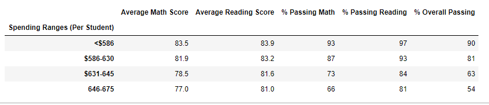

# School District Analysis
Using anaconda, jupyter, and pandas to clean and compile summary data

## Overview
Due to inconsistencies with the Thomas High School's 9th grade math and reading scores, the original school district analysis needed to be redone without those scores. The Thomas High School(THS) 9th grade math and reading scores were removed from the dataset, but the individual students were left in order to correctly total the number of students and per capita spending. Then, when calculating the % Passing Math, $ Passing Reading, and % Overall Passing for THS, we had to subtract the number of 9th graders from the total student count to correct for the missing grade data and append these ammounts to the final per school summary. 

The results of this data is meant to assist the School Board in reviewing school performance and making budgeting decisions. 
[PyCitySchools_Challenge](PyCitySchools_Challenge.ipynb)

## Results

### How is the district summary affected? 

The district summary data showed slightly lowered averages and percentages of passing scores after removing the THS data.

* Average math score decreased by 0.1
* Average reading score remained unchanged
* Percentage passing math decreased by 0.2
* Percentage passing reading decreased by 0.3
* Percentage overall passing decreased by 0.1
 
District Summary Results including THS 9th Grade data:

District Summary Results with THS 9th Grade data removed:

### How is the school summary affected?

The THS summary data showed lower percentages of students passing math and reading when the 9th grade scores were removed. 

* Average math score decreased by 0.07
* Average reading score decreased by 0.05
* Percentage passing math decreased by 0.08
* Percentage passing reading decreased by 0.29
* Percentage overall passing decreased by 0.32

### How does Thomas High School's performance compare?

After removing the 9th grade reading and math scores for THS, the performance metrics for THS were only slightly changed. The school is second on the list of top 5 schools for the overall passing percentage before and after the data removal. After removing the data, the % Overall Passing for THS is closer (within 0.1) to the 3rd, 4th, and 5th highest % Overall Passing. 

### How does replacing the 9th grade scores affect the following:

#### - Math and reading scores by grade:
THS now shows "NaN" in the math and reading scores for 9th Grade. The other grade averages for THS, and the other schools are unchnaged. 

#### - Scores by school spending:
THS is in the $631-645 spending category which is unchanged by the removal of the 9th grade THS scores. Before rounding the data, you can see small decreases in the average scores and percentage passing metrics for this category, but after rounding the data appears the same as before the data was removed. 

#### - Scores by school size:
THS is in the Medium (1000,1999) size category, which is unchanged by the removal of the 9th grade THS scores. Before rounding the data, you can see small decreases in the average scores and percentage passing metrics for this category, but after rounding the data appears the same as before the data was removed. 

#### - Scores by school type:
THS is in the Chart School category, which is unchanged by the removal of the 9th grade THS scores. Before rounding, you can see slight decreases in the average scores and percentage passing metrics, however the differences are smaller than the scores by school spending and size, which alludes to the Charter School data being more closely distributed. 

## Summary

When removing the THS 9th grade math and reading scores, we saw a small decrease in performance metrics from THS, but it did not alter the ranking of THS amongst the other schools. 

1. Recalcuating the percentage of passing students for THS required us to subtract the number of 9th grade students from the schools total count. This was an additional step in the analysis, but it was necessary in order to preserve the total school count for the per capita budget analysis. 

The formula that we used for per school percentages used a group by "school_name" to total the grades per school, and then divded by the per school count, so this is incorrect for THS because of the students with NaNs that were not added to the total passing count, but that were included in the school count. 

2. Reviewing the THS Summary data: The biggest difference was in the overall percentage of students who passed reading and math, which decreased from 90.95% to 90.63% after replacing the scores with NaNs. 

3. The math and reading scores per grade clearly show the omission as the entire subset of data retruned "NaN" which appears in the DataFrame as such:

4. Although we see slight decreases in average, THS still comes in as the 2nd highest performing school in the district. The hundredths place of a percentage point is very insignificant in this scenario, which is why the data appears completely unaltered when looking at the original and altered spending summary and size summary results. 

Spending Range Results including THS 9th Grade data:

Spending Range Results with THS 9th Grade data removed:
